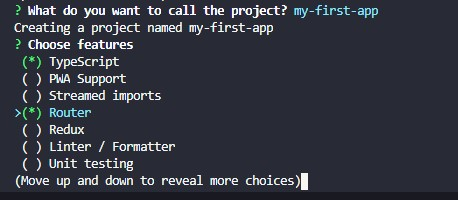

<div align="center">

# 🥏prepare-react-app

An alternative CLI for creating new React projects, with minimalistic approach and many customization possibilities.

[](https://www.npmjs.com/package/prepare-react-app) [](https://npmcharts.com/compare/prepare-react-app?interval=30&minimal=true)    [](https://github.com/bartektelec/prepare-react-app/blob/main/LICENSE)

</div>
<hr />

<div align="center">

</div>

## Why?

I'm tired of using Create React App which ships with a lot of additional dependencies, but doesn't really add any of the most used tooling for React apps. I've wished that React had it's own CLI that does the job as good as i.e. Vue CLI, so you don't need to spend hours to set up a linter for your new project. That's where prepare-react-app comes in handy, it let's you initiate a new React project where you can choose yourself which parts you want to include in your build.

## Usage

1. Install prepare-react-app globally

```bash
npm install -g prepare-react-app
```

Use react-app command to create a new project

```bash
react-app my-app
```

Follow the instructions to set it up as you like

## Development

`npm run build` to compile TypeScript files
`npm run test` to run tests

## Licence

[MIT](https://opensource.org/licenses/MIT)
